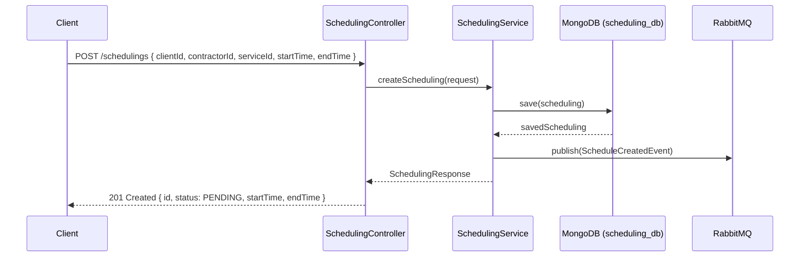
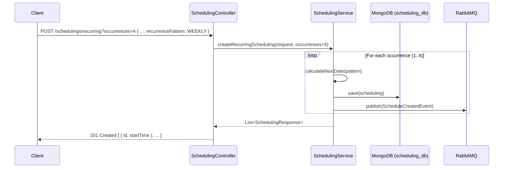
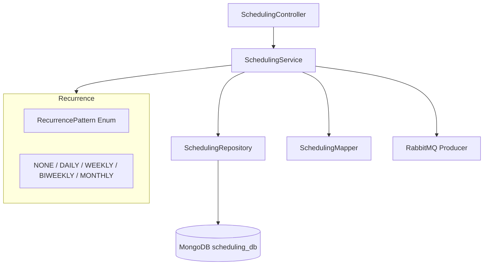

# 🗓️ Scheduling Service

Microservice responsible for managing cleaning appointments in the Clean Pro Solutions platform. Supports one-time and recurring schedules, and emits `ScheduleCreatedEvent` to downstream services.

---

## 📋 Service Info

| Property     | Value                                          |
|--------------|------------------------------------------------|
| Port         | `8084`                                         |
| Database     | MongoDB — `scheduling_db`                      |
| RabbitMQ     | Producer (`ScheduleCreatedEvent`)              |
| Registry     | Eureka (`scheduling-service`)                  |

---

## 🔄 Main Flow — Sequence Diagrams

### Single Scheduling Creation



### Recurring Scheduling Creation



---

## 🏗️ Internal Architecture



---

## 📡 API Endpoints

| Method | Path                               | Request Body / Params                                | Response                               |
|--------|------------------------------------|------------------------------------------------------|----------------------------------------|
| POST   | `/schedulings`                     | `{ clientId, contractorId, serviceId, startTime, endTime, recurrencePattern }` | `201 SchedulingResponse` |
| GET    | `/schedulings/{id}`                | —                                                    | `200 SchedulingResponse`               |
| GET    | `/schedulings/client/{clientId}`   | —                                                    | `200 [ SchedulingResponse ]`           |
| GET    | `/schedulings/contractor/{contractorId}` | —                                              | `200 [ SchedulingResponse ]`           |
| PUT    | `/schedulings/{id}`                | `{ startTime, endTime, ... }`                        | `200 SchedulingResponse`               |
| POST   | `/schedulings/recurring`           | body + `?occurrences=N` (query param)                | `201 [ SchedulingResponse ]`           |
| PATCH  | `/schedulings/{id}/cancel`         | —                                                    | `200 SchedulingResponse`               |
| PATCH  | `/schedulings/{id}/complete`       | —                                                    | `200 SchedulingResponse`               |

> **Important:** `occurrences` is a `@RequestParam` (query parameter), not a field in the request body.

---

## 🔁 RecurrencePattern Enum

| Value      | Description              |
|------------|--------------------------|
| `NONE`     | Single occurrence        |
| `DAILY`    | Every day                |
| `WEEKLY`   | Every week               |
| `BIWEEKLY` | Every two weeks          |
| `MONTHLY`  | Every month              |

---

## ⚙️ Environment Variables

| Variable                    | Description              | Default                                       |
|-----------------------------|--------------------------|-----------------------------------------------|
| `SPRING_DATA_MONGODB_URI`   | MongoDB connection URI   | `mongodb://localhost:27017/scheduling_db`     |
| `RABBITMQ_HOST`             | RabbitMQ host            | `localhost`                                   |
| `RABBITMQ_PORT`             | RabbitMQ port            | `5672`                                        |
| `EUREKA_SERVER_URL`         | Eureka registry URL      | `http://localhost:8761/eureka`                |

---

## 🚀 Build & Run

### Build
```bash
mvn clean install
```

### Run locally
```bash
mvn spring-boot:run
```

### Run with Docker Compose
```bash
docker-compose up scheduling-service
```

---

## 🧪 How to Test

### Create a single scheduling
```bash
curl -X POST http://localhost:8084/schedulings \
  -H "Content-Type: application/json" \
  -d '{
    "clientId": "64a1b2c3d4e5f6a7b8c9d0e1",
    "contractorId": "64a1b2c3d4e5f6a7b8c9d0e2",
    "serviceId": "64a1b2c3d4e5f6a7b8c9d0e3",
    "startTime": "2025-06-01T09:00:00",
    "endTime": "2025-06-01T12:00:00",
    "recurrencePattern": "NONE"
  }'
```

### Create a recurring scheduling (4 weekly occurrences)
```bash
curl -X POST "http://localhost:8084/schedulings/recurring?occurrences=4" \
  -H "Content-Type: application/json" \
  -d '{
    "clientId": "64a1b2c3d4e5f6a7b8c9d0e1",
    "contractorId": "64a1b2c3d4e5f6a7b8c9d0e2",
    "serviceId": "64a1b2c3d4e5f6a7b8c9d0e3",
    "startTime": "2025-06-01T09:00:00",
    "endTime": "2025-06-01T12:00:00",
    "recurrencePattern": "WEEKLY"
  }'
```

### Cancel a scheduling
```bash
curl -X PATCH http://localhost:8084/schedulings/64a1b2c3d4e5f6a7b8c9d0e4/cancel
```

### Get schedulings for a client
```bash
curl http://localhost:8084/schedulings/client/64a1b2c3d4e5f6a7b8c9d0e1
```

---

## 🗂️ Project Structure

```
clean-pro-solutions-scheduling-service/
├── src/main/java/
│   └── com/cleanpro/scheduling/
│       ├── controller/     # REST endpoints
│       ├── service/        # Business logic & recurrence calculation
│       ├── repository/     # MongoDB repositories
│       ├── dto/            # Request/Response records
│       ├── model/          # Scheduling entity & RecurrencePattern enum
│       ├── mapper/         # Entity <-> DTO mapping
│       ├── config/         # RabbitMQ config
│       └── exception/      # Custom exceptions
├── src/test/
└── pom.xml
```
